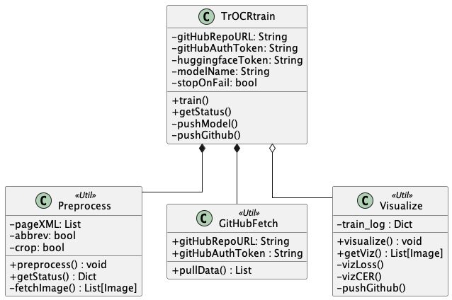

# Service TrOCR Train

March 2024, Jonas & Dana

## Introduction

This includes the decisions that affect the **"TrOCR Train"** service.  
The service will be reachable via API, gets the data from GitHub, preprocesses it, and trains a TrOCR model.  
It's designed in a main class and a few util classes. The actual state contains decisions concerning the logical classes, not yet the API design/code.

### Requirements

- Python >= 3.10
- lxml
- transformers
- pillow
- nltk
- pandas
- GitHub access token

### Preparation

You need to have a GitHub repository, which has been prepared by the Flow GitHub actions. Create a access token and use the repository URL to start the service.
Since we're not yet running an API, this is atm only for runs locally with Python.

## Getting started

- Clone the service GitHub repository
- Install the required Python packages (`pip install -r requirements.txt`)
- Start a new Jupyter notebook or some Python script.
- Import the main class `TrOCRtrain` and run it's steps till training.
- The new trained model should be on Huggingface.co

## Specific feature description

Since we don't want anyone to up-/download data additionally, everything runs through GitHub and the data processed by the Python service is not persisted.
So the service fetches the Page XML data from the GitHub repository, gets the images for preprocessing through the Transkribus API, creates the lines in the cache, and uses this for training.  
The training service persists the preprocessed data for some time and it can be downloaded, if needed. This will be an API endpoint to get the data.

